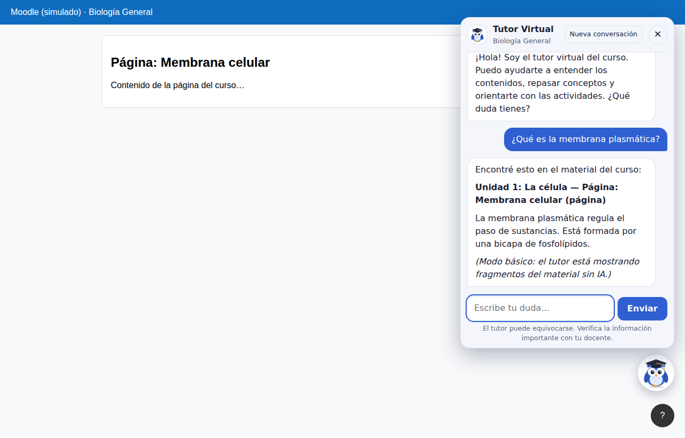

# Tutor Virtual para Moodle 🦉

Un búho tutor aparece en la esquina de **cada curso del aula virtual**. Cuando
el estudiante tiene una duda, hace clic en él y le pregunta en ese momento.
El tutor **lee solo el contenido del curso** desde Moodle (secciones, páginas,
libros, archivos PDF/Word/PowerPoint, tareas con sus fechas…) y responde a
partir de ese material, usando Claude (Anthropic) como modelo de lenguaje.



## Qué hace

- **Lee cada curso automáticamente** con los servicios web de Moodle. No hay
  que copiar nada a mano: cada curso tiene su propio tutor con su propio
  material. Vuelve a leerlo cada 2 horas para incluir lo que el docente agregue.
- **Sabe dónde está el estudiante**: si tiene abierta la página "Membrana
  celular" y pregunta "explícame esto", el tutor sabe a qué se refiere. También
  conoce la fecha de hoy para responder "¿cuándo entrego esta tarea?".
- **Solo usa contenido visible**: las secciones y actividades ocultas no se
  leen. De los cuestionarios solo lee la descripción, nunca las preguntas.
- Explica en español, con ejemplos, y cita la sección o recurso de donde sale
  la respuesta. Si algo no está en el material, lo dice.
- **Integridad académica**: no resuelve tareas, cuestionarios ni exámenes;
  guía con preguntas y explica los conceptos.
- Deriva al docente las consultas sobre notas o prórrogas, y a Bienestar
  Estudiantil los temas personales.
- Funciona en computadora y celular (en el celular el chat ocupa toda la
  pantalla).

Formatos que lee: páginas, etiquetas, libros, descripciones de secciones,
tareas, cuestionarios y foros, archivos **PDF, DOCX, PPTX, ODT, ODP, HTML, TXT,
MD y CSV**, y los enlaces (solo la dirección). No lee imágenes, videos ni PDF
escaneados (que son imágenes sin texto).

---

## Instalación en 3 pasos

### Paso 1: Preparar Moodle (una sola vez, como administrador)

El tutor necesita un usuario de Moodle con permiso para leer los cursos.
Las rutas de menú son de Moodle 4.x; en versiones anteriores pueden variar un
poco (usa el buscador de *Administración del sitio*).

1. **Activar los servicios web**
   *Administración del sitio → General → Características avanzadas* → marca
   **Habilitar servicios web** → Guardar.

2. **Activar el protocolo REST**
   *Administración del sitio → Servidor → Servicios web → Administrar
   protocolos* → activa **REST** (el ícono del ojo).

3. **Crear el usuario del tutor**
   *Administración del sitio → Usuarios → Agregar un usuario*. Por ejemplo:
   nombre de usuario `tutor_ia`, nombre "Tutor", apellido "Virtual".

4. **Crear un rol de solo lectura y asignarlo**
   *Administración del sitio → Usuarios → Permisos → Definir roles → Añadir un
   nuevo rol*:
   - Nombre: `Lector del tutor IA`. Tipo de contexto: **Sistema**.
   - Permite estas capacidades:
     `webservice/rest:use`, `moodle/course:view`,
     `mod/page:view`, `mod/resource:view`, `mod/book:read`,
     `mod/folder:view`, `mod/url:view`, `mod/label:view` (si existe),
     `mod/assign:view`, `mod/quiz:view`, `mod/forum:viewdiscussion`.
   - Guarda. Luego, en *Usuarios → Permisos → Asignar roles de sistema*,
     asigna ese rol al usuario `tutor_ia`.

   *(Así el tutor puede leer todos los cursos sin estar matriculado ni
   aparecer en las listas de participantes.)*

5. **Crear el servicio externo**
   *Administración del sitio → Servidor → Servicios web → Servicios
   externos → Agregar*:
   - Nombre: `Tutor IA`. Marca **Habilitado** y **Solo usuarios
     autorizados**.
   - En *Mostrar más…* marca **Puede descargar archivos** (necesario para
     leer los PDF y documentos).
   - Guarda y pulsa **Funciones → Agregar funciones**. Agrega:
     - `core_course_get_courses_by_field`
     - `core_course_get_contents`
     - `mod_page_get_pages_by_courses`
     - `mod_label_get_labels_by_courses`
     - `mod_assign_get_assignments`
     - `mod_quiz_get_quizzes_by_courses`
     - `mod_forum_get_forums_by_courses`

     (Las cinco últimas son opcionales: sin ellas el tutor lee menos
     detalle de páginas, tareas o foros.)
   - Vuelve a la lista de servicios, pulsa **Usuarios autorizados** y agrega
     a `tutor_ia`.

6. **Crear el token**
   *Administración del sitio → Servidor → Servicios web → Gestionar tokens →
   Crear token*: usuario `tutor_ia`, servicio `Tutor IA`. Copia el token
   (es como una contraseña: no lo compartas).

### Paso 2: Instalar el servidor del tutor

Necesitas un servidor con Python 3.10 o superior, accesible por **HTTPS**
(por ejemplo `https://tutor.tu-institucion.edu.ec`). Moodle debe usar HTTPS
también; si no, el navegador bloquea el chat.

```bash
git clone https://github.com/daysearroyocorozo-pixel/Prueba.git
cd Prueba/tutor
pip install -r requirements.txt

export ANTHROPIC_API_KEY="tu-clave-de-anthropic"
export TUTOR_MOODLE_URL="https://aula.tu-institucion.edu.ec"
export TUTOR_MOODLE_TOKEN="el-token-del-paso-1"

# Comprueba que lee bien un curso (el número es el id del curso,
# el que aparece en la dirección: course/view.php?id=25)
python server.py --probar-curso 25

# Inicia el tutor (en producción, con gunicorn)
pip install gunicorn
gunicorn -w 1 --threads 16 --timeout 0 -b 0.0.0.0:5000 server:app
```

La clave de Anthropic se obtiene en https://console.anthropic.com. Coloca
delante un proxy con HTTPS (Nginx, Caddy, Apache) que redirija a
`localhost:5000`. Con Nginx agrega `proxy_buffering off;` para que las
respuestas aparezcan mientras se escriben.

### Paso 3: Mostrar el búho en todos los cursos

*Administración del sitio → Apariencia → HTML adicional* → en el campo
**Antes de cerrar BODY** pega esta línea (cambiando la dirección por la de tu
servidor) y guarda:

```html
<script src="https://tutor.tu-institucion.edu.ec/widget.js" defer></script>
```

Listo: el búho aparece en todas las páginas de todos los cursos, para los
usuarios que hayan iniciado sesión. No aparece en la portada ni en la página
de acceso.

Opciones del `<script>`:

| Atributo | Ejemplo | Efecto |
|---|---|---|
| `data-posicion` | `data-posicion="izquierda"` | Muestra el búho a la izquierda. |
| `data-abajo` | `data-abajo="120"` | Distancia al borde inferior en píxeles (por defecto 88, para no tapar el botón "?" de Moodle). |
| `data-saludo` | `data-saludo="¿Te ayudo?"` | Cambia el globo de saludo (`data-saludo=""` lo quita). |

---

## Funcionamiento diario

- **Primera vez que se abre un curso**: el tutor lee su contenido en segundo
  plano (de unos segundos a un par de minutos si hay muchos PDF). Mientras
  tanto el chat muestra "Leyendo el contenido del curso…".
- **Actualización**: cada 2 horas (configurable) vuelve a leer el curso la
  próxima vez que alguien lo visita, sin hacer esperar al estudiante.
- **Actualizar al instante** (después de subir material nuevo): define
  `TUTOR_CLAVE_ADMIN` y ejecuta

  ```bash
  curl -X POST -H "X-Clave-Admin: TU_CLAVE" "https://tutor.tu-institucion.edu.ec/api/actualizar?curso=25"
  ```

- El contenido leído se guarda en la carpeta `cache/`, para no volver a
  leerlo de Moodle si el servidor se reinicia.
- El servidor registra en consola los tokens usados por cada respuesta,
  incluidos los leídos del caché, para controlar el costo.

### Costo

El material del curso se envía a Claude en cada pregunta con **caché de
prompt**: cuando varios estudiantes preguntan sobre el mismo curso con pocos
minutos de diferencia, el material se lee del caché a ~10 % del precio
normal. Un curso con 100 páginas de texto (~50 000 tokens) cuesta del orden de
2 a 4 centavos de dólar por pregunta con caché y unos 25 centavos sin él. Para
reducir el costo usa `TUTOR_EFFORT=low` o un modelo más económico
(`TUTOR_MODEL=claude-sonnet-5-5`).

## Configuración (variables de entorno)

| Variable | Por defecto | Para qué sirve |
|---|---|---|
| `ANTHROPIC_API_KEY` | — | Clave de la API de Anthropic. Sin ella el tutor funciona en *modo básico* (muestra fragmentos del material, sin IA). |
| `TUTOR_MOODLE_URL` | — | Dirección de tu Moodle. |
| `TUTOR_MOODLE_TOKEN` | — | Token del servicio web (paso 1). |
| `TUTOR_CURSOS_PERMITIDOS` | todos | Ids de cursos separados por comas, por ejemplo `25,31,40`, para activar el tutor solo en esos cursos. |
| `TUTOR_ACTUALIZAR_MINUTOS` | `120` | Cada cuánto se vuelve a leer un curso. |
| `TUTOR_CLAVE_ADMIN` | — | Clave para `/api/actualizar`. |
| `TUTOR_MAX_CARACTERES_CURSO` | `1200000` | Material máximo por curso (~300 000 tokens). Si un curso lo supera, se recorta el final y se avisa en el registro. |
| `TUTOR_MODEL` | `claude-opus-5-5` | Modelo de Claude. |
| `TUTOR_EFFORT` | `medium` | Profundidad de razonamiento: `low`, `medium`, `high`. |
| `TUTOR_LIMITE_POR_MINUTO` | `15` | Preguntas por minuto permitidas por dirección IP. |
| `TUTOR_ORIGENES_PERMITIDOS` | — | Otros sitios (además de Moodle) donde se puede insertar el chat, separados por comas. |
| `TUTOR_MODO` | `auto` | `ia` o `basico` para forzar un modo. |
| `HOST` / `PORT` | `127.0.0.1` / `5000` | Dirección del servidor (`python server.py`). |

En `curso/config.json` puedes cambiar el nombre del tutor, el mensaje de
bienvenida, cómo contactar al docente y las preguntas sugeridas
(`sugerencias_moodle`).

## Sin Moodle

Si no configuras `TUTOR_MOODLE_URL`, el tutor usa el material de la carpeta
`curso/` (archivos `.md` o `.txt`; trae un curso de ejemplo) y se abre en
`http://localhost:5000`. Sirve para probarlo o para un curso fuera de Moodle.

## Seguridad y privacidad

- El token de Moodle y la clave de Anthropic solo están en el servidor; nunca
  llegan al navegador.
- El tutor solo lee contenido **visible** de los cursos (no lee secciones ni
  actividades ocultas, calificaciones, entregas de estudiantes ni preguntas de
  cuestionarios).
- No se guardan conversaciones en el servidor. El historial vive en la pestaña
  del navegador del estudiante y se borra al cerrarla o con **Nueva
  conversación**. Las preguntas se envían a la API de Anthropic para generar la
  respuesta: informa de ello a los estudiantes según la normativa de tu
  institución.
- El chat solo puede insertarse en tu Moodle (cabecera
  `frame-ancestors`) y solo acepta preguntas enviadas desde su propia página.
- **Limitación importante**: el tutor no verifica la sesión de Moodle del
  estudiante. Alguien que conozca la dirección del servidor del tutor y el
  número de un curso podría hacerle preguntas sobre el contenido visible de ese
  curso sin estar matriculado. Si eso es un problema, limita los cursos con
  `TUTOR_CURSOS_PERMITIDOS` o protege el servidor en la red interna. Para una
  verificación completa del estudiante se puede agregar un pequeño plugin de
  Moodle o una integración LTI.

## Estructura

```
tutor/
├── server.py          Servidor: chat, Claude, caché de cursos, modo básico
├── moodle.py          Lectura de cursos desde Moodle y extracción de texto
├── requirements.txt
├── curso/             config.json + material de ejemplo (modo sin Moodle)
├── static/
│   ├── widget.js      El búho flotante que se inserta en Moodle
│   ├── buho.svg       Imagen del búho
│   ├── index.html     Ventana del chat
│   ├── tutor.css
│   └── tutor.js
└── docs/              Capturas de pantalla
```
